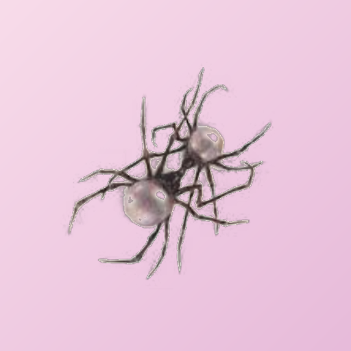

<div align="center">



# Jenny Music

*a music player made for one person*

**[⬇ Download for phone & PC](https://github.com/barbykew/jenny-music/releases/latest)**

</div>

---

### Jenny,

you're always listening to something, so I made you somewhere to keep all of it.

I painted it pastel because those are your colours. There are ten of them in Settings: rose,
cotton candy, lavender, periwinkle, sky, mint, pistachio, butter, peach and clay. Pick one for
whatever mood you're in and change it whenever you like.

The spider is yours as well. When you play something, it shows up next to the song on Discord,
so everyone can see what you're listening to.

Your Spotify playlists can come too. Paste a link and it rebuilds them here, song by song. If it
can't find the exact recording it leaves the song out instead of guessing, because it shouldn't
hand you the wrong version of a song you love.

The first time you open it, it'll walk you through the setup. After that it's just your music.

I hope it plays you a lot of good songs. 💗

---

## Getting it

| | |
|---|---|
| **Phone** | `JennyMusic-…-arm64.apk` from [Releases](https://github.com/barbykew/jenny-music/releases/latest). Open it and allow installing from that app. |
| **PC** | `JennyMusic-…-Windows-Setup.exe`. If Windows says it *protected your PC*, click **More info → Run anyway**. |

## Little things it does

- **Pastel everything.** Ten colours to choose from, and the whole app follows the one you pick.
- **A welcome on first open.** Signing in to YouTube Music, Spotify and Discord happens in one
  place, and each one gets a tick when it's done.
- **Your Spotify playlists, brought over.** Use the **Import** button in Library. If you've already
  copied a playlist link, it's filled in for you.
- **The spider on Discord** shows what you're playing.
- **A Jenny corner** at the top of Settings with just the things you'll actually use.
- Everything SimpMusic already does well: no ads, background play, synced lyrics, an equalizer,
  crossfade and offline listening.

<details>
<summary><b>How the Spotify import picks songs</b></summary>

<br>

Each track is matched against YouTube Music by **running time** rather than by title, because a
title can't tell a studio recording apart from a live take, a sped-up edit or a remix, and all of
those often rank above the original in search. Anything more than six seconds off from the Spotify
duration is rejected, so a song is left out rather than replaced with the wrong one. The ones that
couldn't be found are counted and shown when the import finishes. YouTube Music doesn't have
everything Spotify has, so a few gaps are normal.

Nothing is saved until the whole playlist has been matched, so cancelling halfway leaves nothing
half-built behind.

</details>

<details>
<summary><b>Building it yourself</b></summary>

<br>

Needs JDK 21 and the Android SDK (`compileSdk 37`, listed by the SDK manager as
`platforms;android-37.0`). Put your SDK path in `local.properties` as `sdk.dir=...`, then:

```bash
./gradlew :androidApp:assembleRelease
```

For the Windows installer, build the app image and wrap it with [Inno Setup](https://jrsoftware.org/isinfo.php):

```bash
./gradlew :desktopApp:createDistributable
ISCC.exe installer/jenny-music.iss
```

`core/` is a git submodule, so clone with `--recurse-submodules` or run
`git submodule update --init` afterwards.

</details>

---

<div align="center">

<sub>

Built with love on top of [SimpMusic](https://github.com/maxrave-dev/SimpMusic) by
[maxrave-dev](https://github.com/maxrave-dev). The playback, lyrics and nearly everything else
that makes it a music player are their work, so go give them a star.
Licensed GPL-3.0, like SimpMusic. See [LICENSE](LICENSE).

</sub>

</div>
